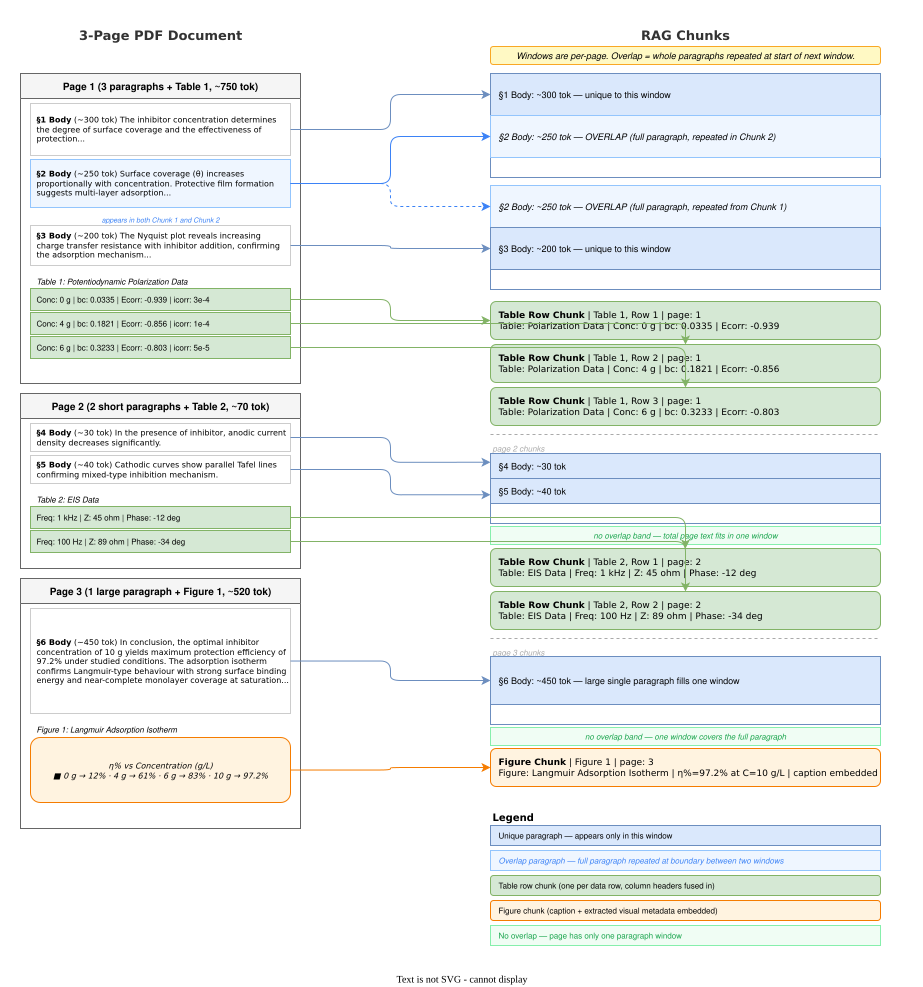

# RAG Pipeline — Tables and Figures, Explained

> **Audience:** Business / technical stakeholders.
> **Purpose:** Slide deck source, standalone — no familiarity with any earlier
> version of this pipeline is required. Each `---` is a slide break; speaker
> notes follow in blockquotes.
>
> For implementation depth, this document links out to
> [PIPELINE.md](PIPELINE.md), [CHUNKING.md](CHUNKING.md), and
> [figure-understanding-extension.md](figure-understanding-extension.md)
> rather than repeating them — read those for exact algorithms and schemas.

---

## Slide 1 — Two Kinds of Content Standard RAG Gets Wrong

### Prose search works. Tables and images don't.

| What users ask | What they get today |
|---|---|
| "What is the corrosion rate at 10g inhibitor?" | A paragraph near the table, maybe |
| "What value is in row 5 of the results table?" | The whole table dumped as text, or a hallucinated guess |
| "What does the balance graph show for this measurement?" | Nothing — the answer is pixels in an image, and images aren't searchable text at all |

**Why tables are hard:** dense information in a small space; column headers give meaning to every value — strip them and the value is meaningless; merged cells break simple extraction.

**Why figures are harder:** the answer often exists *only* inside the image. A caption, if there even is one, rarely describes what the chart or diagram actually shows.

> **Speaker note:** Open with the pain. Most audiences have seen a chatbot that sounds confident but gets the number wrong, or one that just doesn't see charts at all. Both failures are addressed here — tables by careful extraction, figures by actually looking at them.

---

## Slide 2 — Our Approach in One Sentence

### We always know *where* the answer is. We make sure we can *read* it — whether it's text or pixels.

```
Document
  ├─► Tables   Map structure (ADI) → check quality → hard pages get a second read → row-by-row index
  └─► Figures  Detect (ADI) → filter out noise → vision model reads survivors → figure index
        Both paths write into the same search index → one answer, one citation
```

Four principles:

1. **Two readers for tables** — Azure Document Intelligence (ADI) for structure, a second reader for difficult content
2. **Deterministic routing** — explicit rules decide which pages need help; no LLM guessing on tables
3. **Row-level RAG** — each data row is its own searchable fact, not a hallucination risk buried in a paragraph
4. **Selective vision for figures** — cheap geometry filtering happens before any model call, then a vision model describes what survives, in its own words

> **Speaker note:** This is the elevator pitch. Everything after this slide is one of these four principles, made concrete.

---

## Slide 3 — Tables: The Two-Reader Architecture

```
┌─────────────────────────────────────────────────────────────────┐
│                          PDF Document                           │
└─────────────────────────────┬───────────────────────────────────┘
                              │
                              ▼
┌─────────────────────────────────────────────────────────────────┐
│         READER 1 — Azure Document Intelligence (ADI)            │
│  page layout · tables · figures · bounding boxes · confidence   │
│  Always runs. Always the citation authority.                    │
└─────────────────────────────┬───────────────────────────────────┘
                              │
                   ┌──────────────────────┐
                   │  Is this page safe   │
                   │  to trust as-is?     │
                   └────────┬─────────────┘
              ┌─────────────┴──────────────┐
           SAFE ✓                    UNCERTAIN ✗
              │                            │
              ▼                            ▼
    ┌──────────────────┐      ┌──────────────────────────────────┐
    │  ADI result      │      │  READER 2 — second-pass OCR      │
    │  accepted as-is  │      │  one difficult page at a time     │
    └──────────────────┘      └────────────┬─────────────────────┘
                                           │
                              ┌────────────▼───────────┐
                              │  Best result selected  │
                              │  ADI keeps citation     │
                              │  authority either way   │
                              └────────────────────────┘
```

**Today's deployment:** the confidence router and merge logic are fully built
and tested, but the second-pass reader is switched off — ADI handles every
page on its own. It activates automatically once a reader deployment is
attached; nothing about the routing or citation logic changes when it does.

> **Speaker note:** The key insight is that ADI always runs and always owns
> the "where." A second, more expensive reader only touches pages that need
> help with the "what" — and today, table quality on real documents hasn't
> required it. That's a real cost-control result, not a shortcut.

---

## Slide 4 — What Would Trigger the Second Read?

### Four deterministic signals. No LLM involved.

| Signal | Why it matters |
|---|---|
| Cell confidence below threshold | ADI itself reports it struggled reading that cell |
| A data cell spans multiple rows | Merged cells lose their row-group label when read structurally |
| Rotated or mixed-orientation text | Sideways tables produce unreliable cell boundaries |
| A figure overlaps a table | The "table" may actually be a rendered image, not real text |

**Why cell confidence, not word confidence?** A single unusual character (say, a currency symbol at low confidence) would otherwise trigger a false alarm on an entire clean table. Averaging across all words in a cell means only a genuinely weak cell fails the check.

> **Speaker note:** This answers "how does it know when to trust itself?" The rules are explicit and auditable — useful in regulated environments where "the model decided" isn't an acceptable answer.

---

## Slide 5 — Tables Become Rows, Not Blobs

### We don't store the table. We store the facts inside it.

**Naive approach:** the whole table becomes one chunk of text. A query for one cell retrieves — and forces the model to read — everything.

**This pipeline:** one chunk per data row, with column headers fused directly into the text:

```
"Table: Potentiodynamic polarization data | Inhibitor concentration (g): 6 |
 bc (V/dec): 0.3233 | Ecorr (V): -0.8027"
   citation → page 7, table 0, row 3, exact bounding box
```

A raw number like `0.3233` is meaningless on its own — fusing in the header (`bc (V/dec)`) makes it retrievable and interpretable at the same time. Every row also carries a short lead-in from the paragraph just before the table, so a row is findable even when the query only matches surrounding prose, not any cell value.

**Why this scales:** a 5-row table and a 500-row table produce chunks of identical size and identical retrieval precision — each one is a single, independently retrievable fact, never averaged into a vector that drifts toward the whole table's general topic.

> **Speaker note:** This is the design that makes numeric questions work. You're not asking the model to scan a table — you're retrieving the exact row and asking it to read one fact.

---

## Slide 6 — The Figure Problem, With a Real Example

### Some answers exist only as pixels.

A retrieval question against a real technical document:

> *"What does the balance graph show about mechanical alignment in extension?"*

**The answer:**

> The balance graph shows the implant will be too tight medially in extension —
> measured at **9mm** against a target of **12mm**.

Neither number appears anywhere in the document's text. They exist only inside a chart image — a planning screenshot with the two values printed directly on it. Before figure understanding, this question was unanswerable: the retrievable chunk would have been the caption, if one even existed, and nothing else.

> **Speaker note:** This is the single most important slide in the deck. Pause on it. Then show the actual crop if you have it handy — the audience sees the two numbers highlighted on screen, and the abstraction becomes concrete.

---

## Slide 7 — How Figures Get Read

### Detect → filter → describe. One model call per figure, not per page.

```
ADI figure detection  (polygon + caption, if any)
        │
        ▼
Deterministic filter   — reject logos, rule lines, headers/footers
        │                 on geometry alone. No model call yet.
        ▼
Vision model            — reads the surviving crop, returns a
                           structured description: category, what's
                           visible, labels, and an explicit
                           "uncertain" field rather than a guess
        │
        ▼
Figure chunk indexed    — searchable by what the image *shows*,
                           not by its (often absent) caption
```

**Why per-figure, not per-page?** A single page can hold a meaningful diagram next to a company logo. Sending the whole page gets one page-level judgment; sending each figure individually gets a correct decision, description, and citation for each one — the logo rejected, the diagram kept.

**ADI still owns the citation.** The vision model only supplies the *description*; the page number and bounding box always come from ADI, exactly as with tables.

> **Speaker note:** This is the same "two readers" pattern from tables, applied to images: a cheap, deterministic step decides who needs the expensive read.

---

## Slide 8 — Filtering Before Spending Any Money

### Real numbers from a 159-page product catalog:

```
  330 figures found by Document Intelligence
  195 qualified   135 rejected — on geometry alone, before any model call
       105  a repeated small corner logo
        16  thin decorative rule lines
        14  header/footer furniture
```

**41% of detected figures never cost a model call.** That's deterministic — same input, same decision, no variance to explain to an auditor — and it's why the cost of this feature scales with genuinely meaningful content, not with page count.

A per-document cap keeps cost bounded on very figure-dense documents: figures beyond the cap are still cropped and indexed, just without a generated description, so nothing is silently dropped from the index.

> **Speaker note:** If asked "why not just describe everything?" — this slide is the answer. The filter is cheap; the vision call isn't. Spend it only where it's earned.

---

## Slide 9 — One Rule Covers Both Features

### ADI is always the citation authority — for table cells and for figures.

```
                Every citation traces back to:
                  • document
                  • page number
                  • bounding polygon
                regardless of which reader supplied the content
```

Whether a fact came from ADI directly, from a second-pass table reader, or from a vision model's figure description, the *location* of that fact — where to look in the original PDF — always comes from ADI. Text and image content can be enriched; the "where" never depends on a probabilistic model.

> **Speaker note:** This answers "how do I know the citation is right?" — it's the same guarantee for a table row and for a figure. The reader that improves the *content* is never the reader trusted for the *location*.

---

## Slide 10 — Why This Is Trustworthy

| # | Design choice | Why it matters |
|---|---|---|
| 1 | ADI is always the citation authority | Location never depends on a probabilistic model's output |
| 2 | Table routing is deterministic | No LLM guesswork in deciding which pages need help |
| 3 | Figures are filtered before any vision call | Cost scales with meaningful content, not page count |
| 4 | Vision output is schema-constrained | The model can't invent an identity, measurement, or warning — it must say when it's unsure |
| 5 | Row-level chunks with fused headers | Every retrieved fact carries its own context |

**Particularly relevant for:** regulated industries, scientific reporting, financial documents, engineering and technical specifications — anywhere a wrong number is worse than no answer.

> **Speaker note:** Point 4 is worth dwelling on for technical audiences: the vision model is explicitly instructed not to guess, and has a dedicated field to flag what it couldn't read.

---

## Slide 11 — What the User Experience Looks Like

**A table question:**

> "What is the corrosion rate at 10g inhibitor concentration?"
> **0.042 mm/year** — *sample-report.pdf, page 3, Table 1, Row 1*

**A figure question:**

> "What does the balance graph show about mechanical alignment in extension?"
> **Too tight medially, 9mm vs. a 12mm target** — *device-manual.pdf, page 7, Figure 3*

**A question the corpus doesn't answer:**

> "What is the recommended tire pressure for a Boeing 747?"
> *The provided sources do not contain any information about that.*

Refusing is the feature, not a failure — retrieval still ran, found nothing relevant, and said so instead of guessing.

> **Speaker note:** End on the user story. All the routing, filtering, and normalization exists to make this deceptively simple experience reliable — including the refusal.

---

## Slide 12 — One-Slide Version

**Title:** From tables and pixels to trustworthy answers

**The challenge:** documents store their most important facts two ways text search misses — dense tables, and images with no useful caption.

**The approach:** a deterministic pipeline reads tables with two specialized readers and quality checks, and reads figures with a filtered, schema-constrained vision pass — then indexes every fact, row and figure alike, with a citation that traces back to an exact page and location.

**Result:** natural-language questions answered from either data source, with exact citations, and an honest "not found" when the answer isn't there.

```
Document → Structure map (ADI) → Quality check → targeted second reads (hard tables, qualified figures)
         → Row-by-row + figure index → Answer with citation, or an honest refusal
```

---

## Appendix — Chunking at a Glance

<details>
<summary>Diagram — a 3-page PDF decomposed into chunks (click to expand)</summary>



</details>

| Term | Plain-language definition |
|---|---|
| ADI (Azure Document Intelligence) | Reads document structure — text, tables, figures, bounding boxes |
| Second-pass reader | An alternate reader (currently disabled in this deployment) used only on pages ADI flags as uncertain |
| Vision model | Reads a figure crop and produces a structured description — category, what's visible, labels |
| Confidence score | ADI's own assessment of how reliably it read each word |
| Chunk | One retrievable unit in the search index — one table row, one paragraph, or one figure |
| Qualification | The deterministic geometry filter that rejects obvious noise before any figure reaches the vision model |
| Citation | Document, page, and bounding polygon — always sourced from ADI, whichever reader supplied the content |

---

## See also

For exact algorithms, schemas, and current known gaps:

- [PIPELINE.md](PIPELINE.md) — the ingestion spine and confidence routing in full
- [CHUNKING.md](CHUNKING.md) — chunk shapes and normalization passes
- [figure-understanding-extension.md](figure-understanding-extension.md) — the vision-model call, its prompt, and its accuracy gap
- [DEMO.md](DEMO.md) — a live runbook for presenting this pipeline against real documents
